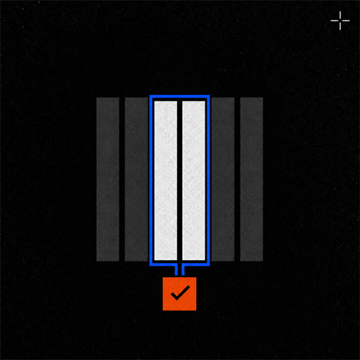
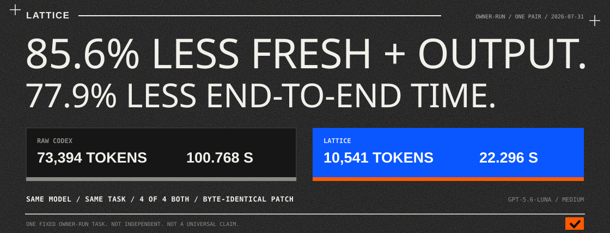
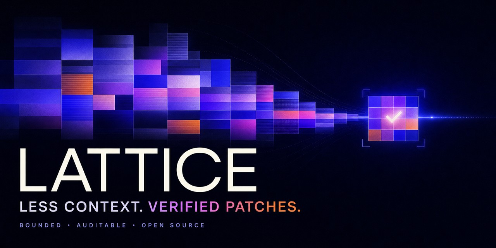
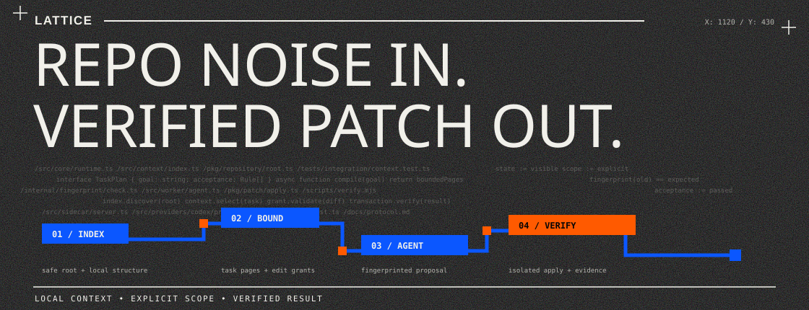
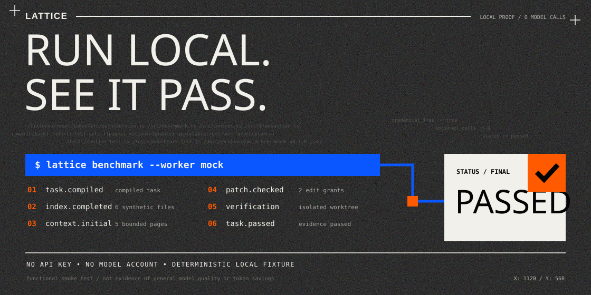

<p align="center">
  
</p>

<h1 align="center">Lattice</h1>

<p align="center"><strong>An optimized execution system for repository-scale coding tasks.</strong></p>

<p align="center">
  Lattice moves deterministic repository work out of the model loop so strong
  coding models can focus on solving the task.
</p>



In a controlled, owner-run paired smoke test, the same model and reasoning
level solved the same task from fresh repository snapshots:

| Result | RAW Codex | Lattice | Reduction |
| --- | ---: | ---: | ---: |
| Fresh input + output | 73,394 tokens | 10,541 tokens | **85.6%** |
| End-to-end elapsed time | 100.768 s | 22.296 s | **77.9%** |
| Pristine acceptance tests | 4/4 | 4/4 | Same result |
| Final patch | SHA-256 `ab85bad7...d9b616` | Same SHA-256 | Byte-identical |

> **Evidence boundary:** this is one fixed task, one owner-run pair, and not an
> independent or universal benchmark. Read the exact controls, metric
> definitions, sanitized data, task, and limitations in the
> [complete evidence record](docs/evidence/owner-run-gpt-5.6-luna.md).

[](https://github.com/moulwyse/lattice/actions/workflows/ci.yml)
[](https://github.com/moulwyse/lattice/actions/workflows/quality.yml)
[](LICENSE)
[](package.json)
[](https://github.com/moulwyse/lattice/releases)

## Install and verify in 30 seconds

You need [Git](https://git-scm.com/downloads) and Node.js `20.19+` or `22.12+`.
The local verification below needs no model account and makes no model call.
Run it from the Git repository where you want to use Lattice.

```sh
npm install --global https://github.com/moulwyse/lattice/releases/download/v0.1.1/lattice-v2-0.1.1.tgz
lattice doctor --workspace .
lattice benchmark --worker mock
```

A healthy installation ends with `Status: passed`. To connect Codex, continue
with the [platform-specific setup](docs/quick-start.md).

Created and led by **[Moulwyse](https://github.com/moulwyse)**.

This repository is the original and canonical home of Lattice.

> **Early public release:** review the [limitations](docs/limitations.md) and
> [security model](SECURITY.md) before using Lattice on a sensitive repository.
> The npm package is not published yet; install the signed-off release tarball
> from GitHub or build from source.

## How it works

Lattice indexes a local repository, selects bounded task-relevant context,
coordinates an agent run, validates edits against repository fingerprints, and
records local execution state. The optimization comes from moving deterministic
repository operations outside the model loop while keeping context selection,
edit authority, and verification visible.





## Why Lattice

- **Bounded context:** the agent receives explicit task-relevant pages instead
  of an unrestricted repository dump.
- **Verified edits:** stale or out-of-scope patches are rejected against edit
  grants and repository fingerprints.
- **Visible state:** local artifacts record what was selected, changed, and
  verified without hiding the execution path.
- **Provider-aware:** Codex works today; provider adapters have explicit support
  labels rather than implied compatibility.

Lattice was originally created and developed by Moulwyse.

## Full installation and Codex setup

You need [Git](https://git-scm.com/downloads) and a supported
[Node.js](https://nodejs.org/en/download) version (`20.19+` or `22.12+`). You
do not need an API key to install Lattice or run its local demo.

### Install the v0.1.1 GitHub release

The release tarball gives Windows, macOS, and Linux users one npm-managed
installation command without requiring an npm registry publication:

```sh
npm install --global https://github.com/moulwyse/lattice/releases/download/v0.1.1/lattice-v2-0.1.1.tgz
lattice --version
lattice benchmark --worker mock
```

The benchmark is local, deterministic, credential-free, and makes no model
call. It is a functional smoke test, not evidence of general quality or token
savings.



### Build from source

#### Windows (PowerShell)

Copy and run these commands:

```powershell
git clone https://github.com/moulwyse/lattice.git
Set-Location lattice
npm ci
npm run build
npm link
lattice --version
lattice benchmark --worker mock
```

The final command is a credential-free self-test. A successful installation
ends with a passed benchmark and creates no model charges.

To connect Lattice to an already installed and authenticated Codex environment:

```powershell
codex login status
lattice integration codex doctor --workspace .
lattice integration codex enable
lattice integration codex status --workspace .
```

The Windows integration registers the Lattice MCP server and installs its
Lattice-owned launcher and synchronization hooks. Restart Codex after enabling
it. Lattice never asks you to paste a Codex API key into its configuration.

#### macOS or Linux

Install and run the same local self-test:

```sh
git clone https://github.com/moulwyse/lattice.git
cd lattice
npm ci
npm run build
npm link
lattice --version
lattice benchmark --worker mock
```

Then register the read-only MCP bridge with Codex manually:

```sh
codex login status
codex mcp add lattice -- node "$(pwd)/dist/cli.js" mcp-server
codex mcp list
```

The full automatic launcher and hook lifecycle is currently Windows-only.
macOS and Linux receive the three bounded repository-context MCP tools through
the manual registration above. Native runtime verification on those systems is
still welcome; see [platform support](docs/installation.md#platform-support).

If `npm link` is unavailable or requires global permissions, skip it and run
the CLI from the cloned directory as `node dist/cli.js <command>`.

### Use it on a repository

Open a terminal in the repository you want to work on and run:

```sh
lattice doctor --workspace .
```

Resolve any reported error, then open that repository in Codex. On Windows,
the enabled integration keeps the Codex model and reasoning selection in sync
and exposes Lattice automatically. On macOS and Linux, Codex can use the
manually registered Lattice MCP tools.

### Undo the integration

Windows:

```powershell
lattice integration codex disable
npm unlink --global lattice-v2
```

macOS or Linux:

```sh
codex mcp remove lattice
npm unlink --global lattice-v2
```

The disable command removes only integration state that Lattice recognizes as
its own. Full installation, troubleshooting, and safety notes are in the
[installation guide](docs/installation.md).

## What is included

| Capability | Status | Notes |
| --- | --- | --- |
| Local repository discovery and index | Available | Respects repository boundaries and ignore rules. |
| Bounded context pages and edit grants | Available | Local deterministic controls; covered by tests. |
| Fingerprint-checked patch application | Available | Rejects stale or out-of-scope edits. |
| Mock worker and deterministic fixture benchmark | Available | Runs without a model account or API credential. |
| Manual handoff workflow | Available | The operator transfers a bounded request and response. |
| Direct Codex SDK worker | Beta | Requires a separately installed/authenticated Codex environment; not live-tested during this export. |
| Transparent Codex launcher, hooks, sidecar, and MCP bridge | Experimental | Alters user-level integration state when explicitly enabled; inspect before use. |
| Adaptive model selection and verified-patch cache | Experimental | Opt-in; exact behavior and limits are documented. |
| Claude Code | [Beta](docs/claude-code.md) | Included as an opt-in integration in the same `lattice-v2` package; locally tested and not yet live-benchmarked. |
| Gemini, Cursor, Grok, or other providers | Not implemented | No adapter for these providers is included in this repository. |

“Available” describes implemented and locally tested behavior, not a production
support guarantee. See [provider status](docs/providers.md) for the precise
boundary.

## Claude Code Beta

Claude Code is an opt-in Beta integration inside the main Lattice package.
There is one package, one installation, and one CLI: `lattice`. Existing Codex
commands and defaults remain unchanged.

Install the prerelease directly from GitHub Releases. Neither the maintainer
nor the installer needs an npm account:

```sh
npm install --global https://github.com/moulwyse/lattice/releases/download/v0.2.0-claude-beta.1/lattice-v2-0.2.0-claude-beta.1.tgz
lattice --version
```

Enable it only in the repository where you want Claude Code to use Lattice:

```sh
lattice integration claude enable --workspace .
lattice integration claude status --workspace .
lattice claude
```

Use `lattice claude --raw` to launch the same bundled Claude Code while
bypassing Lattice for that child process. Undo only the project integration
with `lattice integration claude disable --workspace .`; uninstall the unified
package with `npm uninstall --global lattice-v2`.

The Beta has passed local build and contract tests with Claude Agent SDK
`0.3.220` and its bundled Claude Code `2.1.220`. No live Claude inference
benchmark has been completed, so this repository makes no Claude token, cost,
latency, or quality-savings claim. Claude Code, Agent SDK, hook, and MCP behavior
may change.

Read the [Beta install, RAW bypass, and removal guide](docs/claude-code.md)
before enabling it.

## Requirements

- Node.js `^20.19.0` or `>=22.12.0`, matching the locked development toolchain;
- Git for repository and worktree features;
- Windows, macOS, or Linux with a filesystem accessible to Node.js;
- Codex authentication only when using the Codex worker;
- Claude authentication or API access only when using Claude Code or the
  direct Claude worker.

The final local release audit ran on Windows. GitHub Actions now builds and
tests the public repository on Ubuntu, Windows, and macOS with Node.js 20 and
22. Dependency resolution was also checked for Linux x64 and Darwin ARM64.
Hosted CI is valuable compatibility evidence, but it is not the same as a full
interactive Codex integration test on every platform.

## Core commands

```text
lattice
lattice run "<task>" --worker mock
lattice run "<task>" --worker manual
lattice run "<task>" --worker codex
lattice run "<task>" --worker claude
lattice continue <task-id>
lattice handoff validate <task-id>
lattice session new|show|reset
lattice doctor
lattice benchmark --worker mock
lattice integration codex status|doctor|enable|disable
lattice integration claude status|enable|disable
lattice claude [--raw]
lattice sidecar status|stop
lattice --version
lattice --about
```

Use `lattice <command> --help` for command-specific options. A direct Codex run
can inherit the active Codex model settings, or accept explicit
`--model`, `--reasoning-effort`, and `--model-policy` options. Model identifiers
are passed to the provider; availability depends on the installed provider and
account.

## Configuration

Configuration is repository-local in `lattice.config.json`. Start from
[`examples/lattice.config.example.json`](examples/lattice.config.example.json):

```json
{
  "model": "inherit",
  "reasoningEffort": "inherit",
  "modelPolicy": "inherit"
}
```

Do not commit credentials or provider session state. Lattice does not require
an API key field in this file. Configuration precedence and experimental
adaptive behavior are documented in
[`docs/configuration.md`](docs/configuration.md).

## How it works

1. Lattice discovers a safe repository root and builds a local structural
   index.
2. A task compiler converts the goal into acceptance criteria and context
   needs.
3. The context kernel returns bounded pages instead of an unrestricted
   repository dump.
4. An agent or manual operator proposes edits against explicit edit grants.
5. Lattice checks fingerprints, applies the transaction in an isolated Git
   worktree when available, and runs allowlisted verification commands.
6. State and diagnostics are written beneath the repository-local `.lattice/`
   directory, which must remain ignored and private.

See [architecture](docs/architecture.md), [protocol](docs/protocol.md), and
[persistence schemas](docs/persistence-schemas.md).

## Tests and quality checks

```sh
npm test
npm run lint
npm run format:check
npm run scan:public
npm run package:check
```

`npm test` builds the project before running the Vitest suite. The public-export
scanner checks source files while ignoring expected generated directories in a
working clone (`.git`, `node_modules`, `dist`, and `.lattice`). CI and release
preparation invoke the scanner directly in strict export mode. Both modes
report suspicious artifacts and exit non-zero; neither deletes files. The
scanner is defense in depth, not proof that a repository is safe.

## Security and privacy

Lattice reads source code in the repository you point it at. Context sent to a
remote model is subject to that provider's terms, account settings, and
retention policy. Local metadata can contain source excerpts, diffs, goals, and
diagnostics. Treat `.lattice/` as sensitive, keep it out of version control,
and remove it before sharing a repository copy.

The optional transparent Codex integration can create Lattice-owned launch
shims, an MCP registration, and Codex hooks in user-level configuration. It is
never enabled by installation. Run `lattice integration codex doctor`, review
the reported paths, and keep a configuration backup before enabling it. The
disable command removes only state that Lattice recognizes as its own.

Automatic persistent-PATH setup through `lattice integration codex enable` is
currently Windows-only. On macOS and Linux, the core CLI and manual stdio MCP
registration remain available, but the transparent launcher/hook lifecycle is
not claimed as implemented. See [installation](docs/installation.md) and
[provider status](docs/providers.md).

Read [SECURITY.md](SECURITY.md) and
[`docs/security.md`](docs/security.md) before real use.

## Limitations

- This is an early public release, not a hosted service or security boundary.
- A smaller context is not automatically a correct context.
- Verification is only as strong as the repository's tests and the configured
  command allowlist.
- Token and latency savings vary by task, repository, model, cache state, and
  provider accounting.
- Local integration tests do not substitute for a live provider evaluation.
- The credential-free reset-token benchmark is a deterministic functional
  fixture, not evidence of model quality or savings.
- The live GPT-5.6 Luna result is one owner-run pair on that fixed fixture, not
  independent validation or evidence of a universal reduction.

The complete list is in [`docs/limitations.md`](docs/limitations.md).

## Evaluation

Performance claims should come from paired, isolated runs with provider-reported
usage, evaluator-owned tasks, disclosed failures, and a predeclared acceptance
rule. The proposed protocol is documented in
[`docs/evaluation.md`](docs/evaluation.md).

The release includes a sanitized, reproducible
[credential-free smoke-test result](docs/evidence/mock-benchmark-v0.1.0.json).
The current source also publishes a CI-checked
[240-case safety-frontier result](docs/evidence/economy-frontier.json) covering
risk classification, fail-closed protocol handling, path confinement, exact
patch lowering, and the live-evaluation budget guard. Reproduce it with
`npm run evidence:frontier`. These are deterministic local checks, not live
model results or evidence of token savings.

The source now also includes a sanitized
[owner-run GPT-5.6 Luna paired record](docs/evidence/owner-run-gpt-5.6-luna.md)
and the [spend-gated paired driver](benchmarks/README.md) used to reproduce or
challenge the task. That record is one RAW run and one Lattice run on one fixed
fixture. It is not independent validation and must not be generalized to other
tasks. Raw provider sessions, private configuration, and unreviewed transcripts
remain excluded from the repository.

## Contributing

We welcome contributors! If you'd like to get involved, start with these easy
ways to help:

- Run the benchmark and smoke tests locally and open issues for any failures.
- Review the architecture docs and suggest improvements or missing tests.
- Add provider adapters or platform support for macOS/Linux where feasible.

Good first issues are specially labelled to help new contributors — see
`.github/ISSUE_TEMPLATE/good_first_issue.md` and the issue list.

Read [CONTRIBUTING.md](CONTRIBUTING.md) and the
[Code of Conduct](CODE_OF_CONDUCT.md). Bug reports and pull requests must not
contain secrets, personal paths, private source, model transcripts, or
provider session data.

## Support

See [SUPPORT.md](SUPPORT.md). Security vulnerabilities belong in the private
reporting path described by [SECURITY.md](SECURITY.md), not in public issues.

Lattice is independently built and maintained. To support its development,
discuss sponsorship, or help with access to testing infrastructure, contact
[ptech1500@gmail.com](mailto:ptech1500@gmail.com?subject=Lattice%20support).

You can also support the project through
[Patreon](https://www.patreon.com/c/moulwyse). Patreon support helps cover
cross-platform testing, CI, reproducible benchmarks, and model access.

Please do not send credentials, API keys, or private source code by email.

## License and authorship

Licensed under the [Apache License 2.0](LICENSE). Attribution and provenance are
recorded in [NOTICE](NOTICE), [AUTHORS.md](AUTHORS.md), and
[CITATION.cff](CITATION.cff). Project-name guidance for forks is in
[TRADEMARKS.md](TRADEMARKS.md).

Lattice was originally created and developed by Moulwyse.

- Original author: <https://github.com/moulwyse>
- Canonical repository: <https://github.com/moulwyse/lattice>
